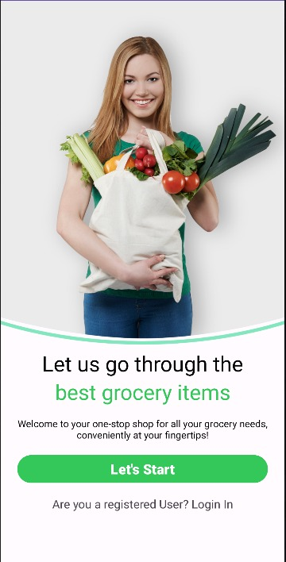
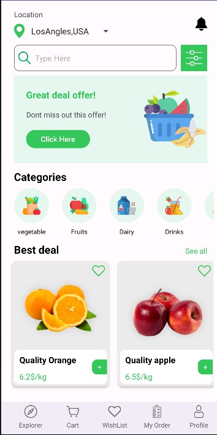
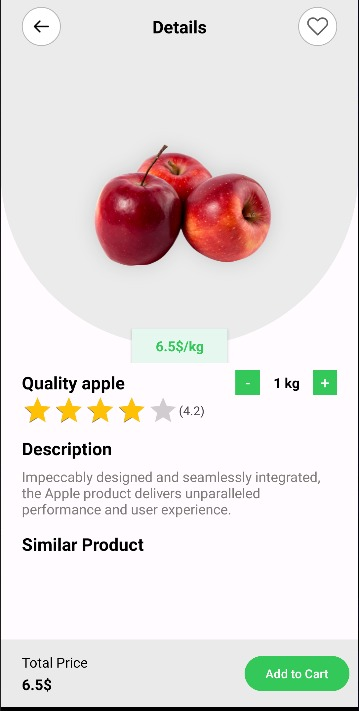

# Grocery Application

This is a native Android application designed to manage grocery shopping efficiently. The app provides functionalities for browsing products, managing deliveries, and processing payments.

## Features

- **User Login**: Secure login functionality with hardcoded credentials for demonstration.
- **Dashboard**: Displays categories and best deals using RecyclerView.
- **Product Details**: Detailed view of products with options to adjust quantity and view similar items.
- **Delivery Management**: Allows users to input and save delivery details.
- **Payment Processing**: Handles payment transactions and updates the database.

## Activities

- **MainActivity**: Entry point of the application, navigates to login or dashboard.
- **LoginActivity**: Manages user authentication.
- **DashboardActivity**: Displays categories and best deals.
- **DetailActivity**: Shows detailed information about a selected product.
- **DeliveryActivity**: Collects and saves delivery information.
- **PaymentActivity**: Processes payments and confirms transactions.

## Technical Details

- **Language**: Java
- **Database**: Uses SQLite for storing delivery and payment information.
- **Libraries**: Utilizes Glide for image loading.

## Setup and Installation

1. Clone the repository.
2. Open the project in Android Studio.
3. Build the project and run it on an Android emulator or device.

## Credentials

- **Email**: user@test.com
- **Password**: 123

## Screenshots

## License

This project is licensed under the MIT License.
